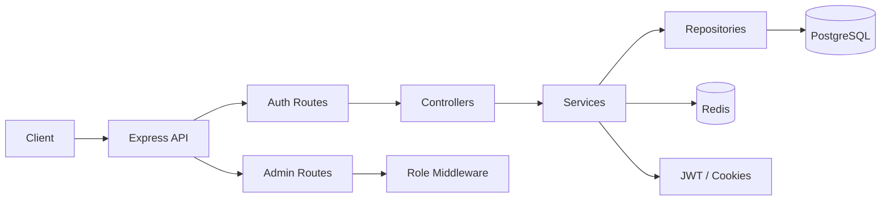

# Project Overview

This project is a backend authentication system built with TypeScript and Express. It handles user signup, login, token-based sessions, password reset, email verification, and role-protected routing.

The service is designed to be secure, modular, and easy to extend for frontend or microservice integration.

---

## Core Goals

- Register and authenticate users securely
- Protect private routes using JWT and session validation
- Hash passwords with Argon2
- Use Redis to manage sessions and refresh tokens
- Use PostgreSQL as the source of truth for user data
- Add verification and reset flows for account security
- Restrict admin features through role-based middleware

---

## Architecture



---

## Request Flow

1. Client sends a request to the server.
2. Middleware validates headers, cookies, rate limits, and request payloads.
3. Controller receives the request and delegates business logic.
4. Service layer performs authentication, session, and token operations.
5. Repository layer interacts with PostgreSQL.
6. Redis stores refresh session metadata and token validation state.
7. Response is returned with sanitized data and secure cookies.

---

## Main Components

### 1. API Layer

Located in the auth service source directory, this layer includes:

- Express app bootstrap
- route registration
- middleware chaining
- error handling
- CORS and security policies

### 2. Controllers

The controller layer handles:

- user registration
- login and logout
- password reset requests
- email verification
- session refresh
- protected profile access

### 3. Services

Business logic sits in the service layer and includes:

- user creation and login flows
- token generation
- refresh session management
- verification token generation
- password reset logic

### 4. Repositories

Repository modules isolate database access and keep queries separated from business logic.

### 5. Middleware

Middleware enforces:

- authentication checks
- role checks for admin routes
- validation using Zod schemas
- rate-limiting
- verified-account requirements
- centralized error handling

---

## Authentication Model

The project uses a secure token-based authentication pattern:

- Passwords are hashed using Argon2 before storage.
- Access tokens are used for short-lived request authorization.
- Refresh tokens are used to renew sessions without re-entering credentials.
- Session metadata is stored in Redis for validation and replay prevention.
- HTTP-only cookies prevent browser JavaScript from reading the auth tokens directly.

---

## Database Responsibilities

PostgreSQL is used for persistent application data such as:

- users
- password hashes
- email verification metadata
- role assignment
- account status information

Redis is used for fast, temporary session-related data such as:

- active refresh token tracking
- session invalidation
- login session metadata

---

## Security Considerations

This system includes several important protections:

- password hashing with Argon2
- JWT and cookie-based session handling
- validation of all incoming request payloads
- role-based access restriction for admin endpoints
- rate limiting on authentication routes
- secure cookie settings for production environments
- centralized error handling to avoid leaking sensitive internals

---

## Example Flow

### Registration

```text
User submits email + password
-> validate payload
-> check if user already exists
-> hash password
-> store user in PostgreSQL
-> generate verification token
-> return success response
```

### Login

```text
User submits email + password
-> validate inputs
-> fetch user from database
-> verify password hash
-> generate access and refresh tokens
-> store refresh session in Redis
-> set secure cookies
-> return user payload
```

### Admin Access

```text
Request hits /admin/dashboard
-> requireAuth middleware
-> requireRole(['ADMIN']) middleware
-> allow only admin users
-> send protected admin response
```

---

## Extensibility

This backend is ready to be extended with:

- email delivery integration with a real SMTP or provider service
- OAuth login (Google, GitHub, etc.)
- multi-factor authentication
- user profile management
- audit logs and activity tracking
- a frontend client using the API

---

## Summary

The project is a robust authentication backend service built around secure practices and clear separation of concerns. It is suitable as a foundation for real-world applications that need login flows, protected APIs, and admin authorization.
